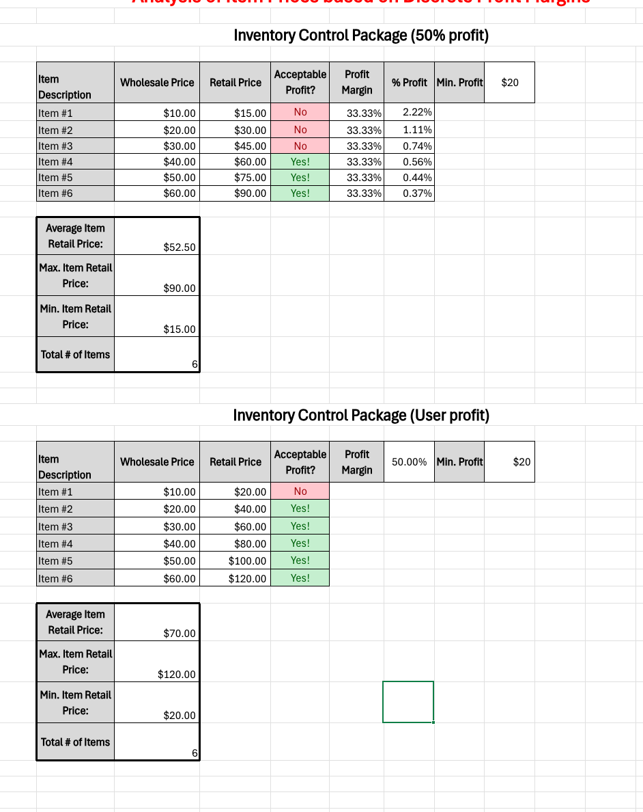
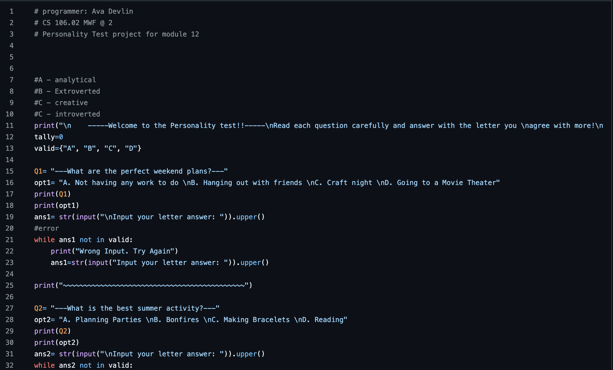
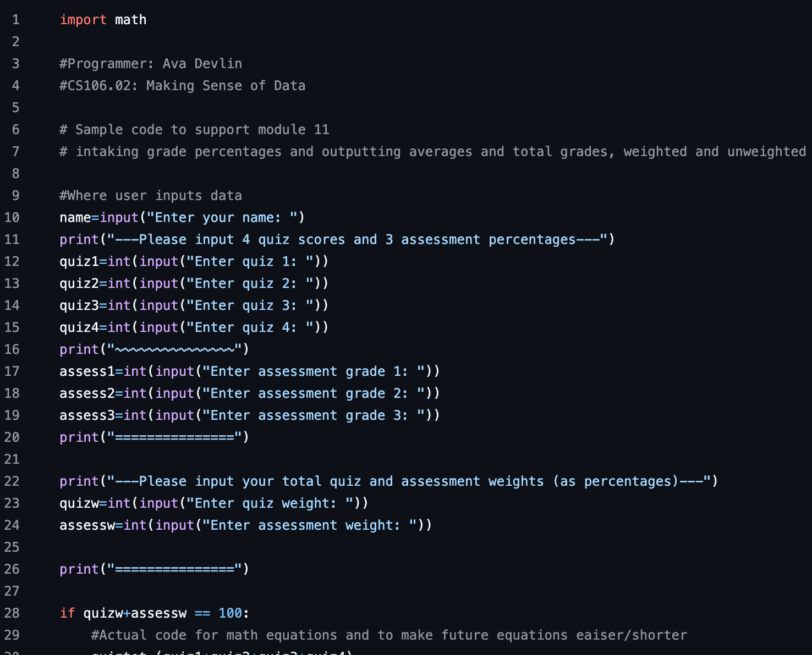

# CS105/6/7/8 Portfolio
# Ava Devlin
## Portfolio
Contact Info: adevlin@loyola.edu; LinkedIn: https://www.linkedin.com/in/ava-devlin-790712281/
### About Me 
Hello! I am an experienced Office Assisstant and filing professional with over 4 years of proven expertise in scheduling and resolving issues in the workplace. 
 
With skills in conflict mangement, communication, computer filig, and customer service, I am able to communicate with over 400 employees, and achieve new organizational methods. I am adept at using Excel, Word, and Google Slides. 
 
My wide skill set, commitment to communication, and passion for self improvement makes me as a valuable asset.  In my spare time, I like to cross-stitch and hike. 

You can find me on https://www.linkedin.com/in/ava-devlin-790712281/.

### Education 
Sophmore at Loyola University Maryland
***
### Projects

#### Price Analytics
 - I automated a google sheet to give stats such as minimum, maximum, average, etc. on a group of sales items 

 - (https://studentsloyola-my.sharepoint.com/:x:/g/personal/adevlin_loyola_edu/IQCsKjm0NTK5Q6-J_CgkkCptAamkk0TZABTmLXsqMf2qAEE?e=fegHEs)
***
#### Personality Test
 - I used all of my knowledge with python to create questions and answers. Python keeps in mind what the user inputs and depending on the answer was it gives a specific personality.
 - 
 - (https://github.com/LoyolaUnivMD/sp26-cs105-python-final-project-adevlin1925210.git)
***
#### Grade Calculator
 - In python, I coded a grade calculator. The user inputs their grades annd how much their assingmnet weight, and the coding gives them their average grade (weighted and unweighted) including their letter grade! It also lets the user know if they inputed data wrong. 
 - 
 - https://github.com/LoyolaUnivMD/sp26-cs105-python-week-3-adevlin1925210.git
